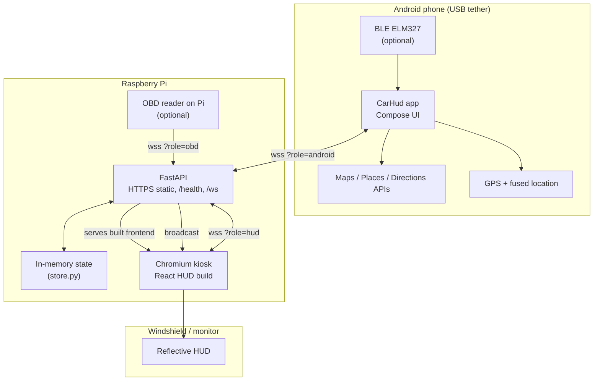
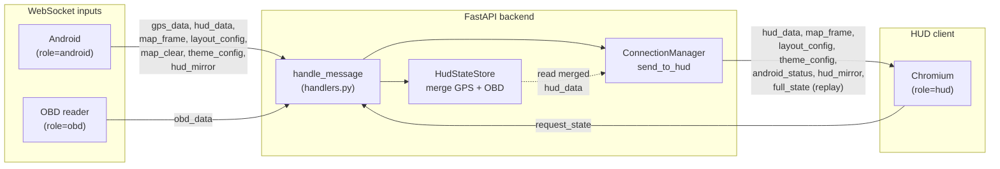

# Car HUD — Raspberry Pi

Raspberry Pi side of a car windshield HUD system. A Pi 4 runs a local React-based HUD displayed on a reflective windshield screen via Chromium kiosk mode. An Android phone connects over USB tethering and acts as the controller and data source — sending vehicle data (OBD-II + GPS), Google Maps imagery, and UI configuration to the Pi in real time over WebSockets.

## Architecture

| Component      | Tech                         | Role                          |
|----------------|------------------------------|-------------------------------|
| Pi Backend     | FastAPI (Python)             | WebSocket server, serves React build |
| Pi Frontend    | React + Vite + TypeScript    | HUD rendering in Chromium     |
| Pi Display     | Chromium kiosk mode         | Fullscreen browser, CSS-mirrored |
| Android App    | Kotlin + Jetpack Compose     | Controller, data source       |
| Communication  | WebSocket over USB tether    | Real-time bidirectional messaging |

Data flow is mostly **one-way from phone to display**: the Android app pushes GPS, map frames, layout, and HUD prefs to the Pi; the backend merges them and broadcasts to the Chromium HUD. The HUD can request a full state replay on reconnect.

### System overview



### Backend pipeline (merge and broadcast)



### Project Structure

```
car-hud-pi/
├── backend/           # FastAPI + WebSocket server
│   ├── main.py
│   ├── ws/             # WebSocket manager & handlers
│   ├── models/         # Pydantic models
│   ├── state/          # In-memory state store
│   └── requirements.txt
├── frontend/           # React + Vite HUD UI
│   ├── src/
│   │   ├── hooks/      # useWebSocket, useHudStore
│   │   ├── components/ # HUD widgets
│   │   ├── layouts/    # Dynamic grid
│   │   ├── styles/     # HUD theme, mirror CSS
│   │   └── types/
│   └── public/
├── systemd/            # hud.service unit
├── networking/         # USB tether config (dhcpcd-usb0.conf)
├── scripts/
│   ├── setup.sh        # Full Pi setup
│   ├── start.sh        # Start backend + Chromium
│   └── build-frontend.sh
├── hud-android/        # Kotlin + Jetpack Compose controller app
│   └── CarHud/
├── archive/legacy/     # Old pygame + Flask app (archived)
└── IMPLEMENTATION_PLAN.md
```

## Quick Start (Development)

**Backend** (from project root):
```bash
pip install -r backend/requirements.txt
uvicorn backend.main:app --reload --host 0.0.0.0 --port 8000
```

**Frontend:**
```bash
cd frontend
npm install
npm run dev
```

**Production build:**
```bash
./scripts/build-frontend.sh
./scripts/start.sh
```

## USB Tether Networking

The Android app connects to the Pi over USB tethering. By default it uses **auto-discovery** to find the Pi on the USB subnet (no manual IP needed). See [docs/USB_TETHERING.md](docs/USB_TETHERING.md) for:

- **Auto-enable USB tethering** – Developer Options → Default USB configuration → USB tethering (no manual toggle when plugging in)
- **Auto Pi discovery** – Set Pi host to `auto` in app Settings (default)

## Chromium Kiosk & Reflective Display (Phase 3)

The HUD uses a horizontal mirror transform (`scaleX(-1)` on `body.hud-mirror-on` in `frontend/src/styles/mirror.css`) so text reads correctly when reflected off the windshield or reflective film. **`scripts/start.sh` opens `https://localhost:8000?mirror=true` by default** (see `HUD_MIRROR` in `start.sh`). The React app sets the initial mirror from that URL query; the Android app can override via WebSocket (`hud_mirror`) while connected.

- **Windshield / reflective material (normal use):** leave the default; Chromium stays mirrored.
- **Testing on a normal monitor** (text will look backward on the glass if you use mirror there): set `HUD_MIRROR=0` for the service, for example:

  ```bash
  sudo systemctl edit hud.service
  ```

  Add:

  ```ini
  [Service]
  Environment=HUD_MIRROR=0
  ```

  Then `sudo systemctl daemon-reload && sudo systemctl restart hud.service`.

`start.sh` launches Chromium in kiosk mode at 1280×720 (or detected resolution) and disables screen blanking. Verify mirrored text with a mirror or phone camera pointed at the reflective surface.

## Pi Boot Integration (Phase 9)

To start the HUD automatically on boot:

```bash
./scripts/setup.sh   # Run once (as pi or with sudo)
sudo reboot          # Or: sudo systemctl start hud.service
```

The setup script installs Python deps, builds the frontend, configures USB tether (`dhcpcd`), disables screen blanking, and enables `hud.service`. Edit `/etc/systemd/system/hud.service` if your project path differs from `/home/pi/car-hud-pi`.

**`hud.service` must run `scripts/start.sh` as an executable.** If you cloned from Windows and the service fails with `status=203/EXEC` / Permission denied, run `chmod +x scripts/start.sh` (or `./scripts/setup.sh`, which fixes `scripts/*.sh`).

### Updating the Pi after `git pull`

Chromium loads the **production build** under `frontend/dist`, not the Vite dev server. After pulling new commits, rebuild the frontend and restart the service:

```bash
cd ~/car-hud-pi   # your clone directory
git fetch origin
git checkout frontend-refine
git pull origin frontend-refine
chmod +x scripts/*.sh
./scripts/build-frontend.sh
sudo systemctl restart hud.service
```

If `backend/requirements.txt` changed, run `pip install -r backend/requirements.txt` again from the project root (use your venv if you use one).

## Implementation Status

See `IMPLEMENTATION_PLAN.md` for the full phased implementation plan. Phases 0–9 (through boot integration) are implemented.

---

## 👤 Author

**Abdiel Marcano** — [Portfolio](https://abdiel-portfolio.vercel.app) · 
[LinkedIn](https://linkedin.com/in/abdiel-marcano)
